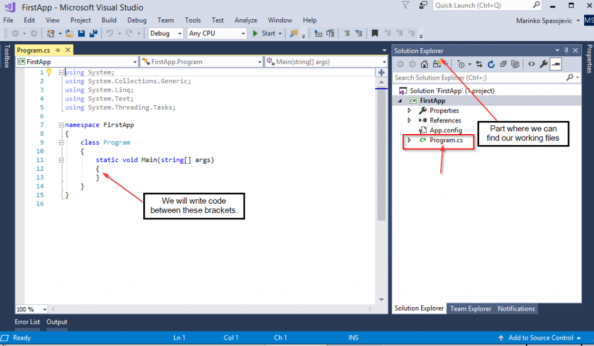

# Conceptos básicos de C #: configuración del entorno de desarrollo

[![Github][github-shield]][github-url]
[![Kofi][kofi-shield]][kofi-url]
[![LinkedIn][linkedin-shield]][linkedin-url]
[![Khanakat][khanakat-shield]][khanakat-url]

## Entorno de desarrollo integrado (IDE)

IDE son las siglas de Integrated Development Environment (Entorno de desarrollo integrado). Básicamente es una herramienta que nos ayuda a desarrollar aplicaciones con mayor facilidad. Tiene muchas características que pueden hacernos la vida más fácil.

Por ejemplo, algunas características comunes incluyen:

- Editor de código fuente
- Depurador
- Compilador
- Plantillas para diferentes tipos de proyectos.
- Mucho más

Nuestro IDE de elección será Visual Studio 2017 Community Edition. Para descargarlo, visite la página de descarga de Visual Studio . Visual Studio tiene soporte para múltiples lenguajes de programación, lo que lo convierte en una herramienta de desarrollo muy popular.

Después de la instalación, podemos comenzar un nuevo proyecto haciendo clic en el menú Archivo y eligiendo Nuevo => Proyecto:

Para este tutorial, usaremos más el proyecto de la aplicación de consola, así que elijamos esa opción:

Después de hacer clic en el botón Aceptar, veremos nuestro proyecto creado. El archivo principal con el que trabajar es el ``Program.cs`` y pronto hablaremos más sobre él:

## Ventana de reloj

En algunos ejemplos, usaremos esta ventana para examinar los resultados. Para abrirlo, primero debemos colocar un punto de interrupción en cualquier línea de código (haciendo clic en el botón izquierdo del mouse):

Luego inicie nuestra aplicación presionando F5, y finalmente para abrir la ventana de visualización:

## Conclusión

Ahora tenemos el IDE perfecto que nos ayudará y el conocimiento para crear un nuevo proyecto. Muy pronto utilizaremos este conocimiento en nuestras aplicaciones.

<!--- reference style links --->
[github-shield]: https://img.shields.io/badge/-@fernandocalmet-%23181717?style=flat-square&logo=github
[github-url]: https://github.com/fernandocalmet
[kofi-shield]: https://img.shields.io/badge/-@fernandocalmet-%231DA1F2?style=flat-square&logo=kofi&logoColor=ff5f5f
[kofi-url]: https://ko-fi.com/fernandocalmet
[linkedin-shield]: https://img.shields.io/badge/-fernandocalmet-blue?style=flat-square&logo=Linkedin&logoColor=white&link=https://www.linkedin.com/in/fernandocalmet
[linkedin-url]: https://www.linkedin.com/in/fernandocalmet
[khanakat-shield]: https://img.shields.io/badge/khanakat.com-brightgreen?style=flat-square
[khanakat-url]: https://khanakat.com