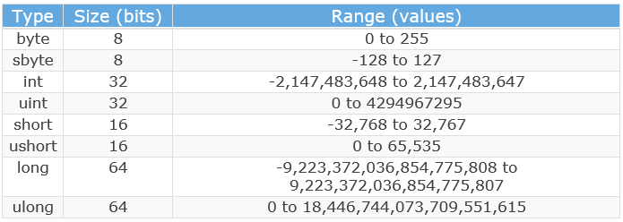
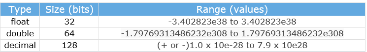
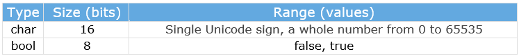

# Tipos de datos, declaraciones y definiciones de variables en ``C#``

[![Github][github-shield]][github-url]
[![Kofi][kofi-shield]][kofi-url]
[![LinkedIn][linkedin-shield]][linkedin-url]
[![Khanakat][khanakat-shield]][khanakat-url]

En C #, los diferentes tipos de datos se registran de forma diferente. Además, también se les permite ejecutar diferentes acciones sobre ellos. Para diferentes tipos de datos, se reserva una cierta cantidad de espacio de memoria en nuestras computadoras.

Con cada tipo de datos definimos:

- Cómo registrar datos en la memoria
- Los posibles valores para esos datos
- Posibles acciones sobre los datos

## Registro de tipo de datos en ``C#``

os tipos de datos que representan números enteros se expresan con un cierto número de bits. Para números sin signo, el rango es de 0 a 2^N -1, y el rango de números con signo es de -2^N-1 a 2^N-1 -1. Entonces, si el tipo de datos tiene un tamaño de 8 bits como el tipo de datos sbyte, podemos representar su rango así: de -2^7 a 2^7 -1 => de -128 a 127.

La siguiente tabla contiene diferentes tipos de datos que representan los números enteros:



La letra ``u`` delante del tipo significa que el tipo no puede contener números negativos, no está firmado.

Los tipos mencionados anteriormente son los tipos de números enteros. Pero en C #, tenemos los tipos de números con punto flotante.

También podemos presentarlos en una tabla:



En C #, tenemos dos tipos de datos básicos más:



Para usar el tipo de caracteres en nuestro código, debemos colocarlo entre comillas simples: 'a' o 'A' o '3' ...

Otro tipo que a menudo se presenta como tipo de datos básico es el tipo de cadena . Pero la cadena no es un tipo de valor, es un tipo de referencia. Para usar una cadena en nuestro código, debemos colocar el valor entre comillas dobles: "Este es el tipo de cadena" o "3452" ...

Entonces, sabemos que tenemos los tipos de valor y los tipos de referencia, y es hora de hablar más sobre ellos y las variables también.

## Variables en ``C#``

Variable es un nombre de una ubicación de memoria en la que la aplicación almacena valores.

Deberíamos crear nuestras variables con los siguientes ejemplos:

- nombre del estudiante
- sujeto
- work_day ...

Los ejemplos incorrectos serían

- nombre del estudiante
- jornada laboral
- 1 lugar

Debemos mencionar que C # es un lenguaje que distingue entre mayúsculas y minúsculas, por lo que el nombre del alumno no es el mismo que el nombre del alumno .

El lenguaje C # tiene su propio conjunto de palabras reservadas, las llamadas palabras clave. No podemos usarlos como nombre para nuestras variables. Para obtener la lista de palabras clave, puede visitar la lista de palabras clave .

Pero si por alguna razón queremos nombrar nuestra variable con una palabra clave, para evitar choques, podemos usar el @signo delante del nombre:

```csharp
int @int; //valid
string @return; //valid
decimal decimal; //not valid
```

### Palabras clave contextuales

Las palabras clave contextuales son las que podemos usar para los nombres de las variables pero sin usar el signo @ al frente:

``add alias ascending async await by descending dynamic equals from get global group in`` 
``into join``
``let nameof on orderby partial remove select set unmanaged value var when where yield``

### Tipos de valor y referencia

En C #, tenemos variables divididas en dos categorías: tipo de valor y tipo de referencia . La diferencia es que las variables de tipo de valor almacenan sus valores dentro de sus propias ubicaciones de memoria, pero la ubicación de memoria para las variables de tipo de referencia contiene solo la dirección de la ubicación de memoria dinámica donde se almacena el valor.

Veamos cómo se comportan los tipos de valor en un ejemplo gráfico:


Hagamos lo mismo para los tipos de referencia:


## Declaraciones y expresiones de variable en C #

Debemos declarar nuestras variables de la siguiente manera:

``<data type> <variable name> ;  or <data type> <variable name>, <variable name> ... ;``

Entonces, algunos ejemplos serían:

```csharp
class Program
{
    static void Main(string[] args)
    {
        int age;
        double temperature, change;
        Student student;
    }
}
```

Solo con la declaración, no podemos asignar un valor a una variable de tipo de valor. Para hacer eso, necesitamos usar expresiones además:

``<data type> <variable name> = <expression> ;``

Nuevamente, veamos esto con un ejemplo:

```csharp
class Program
{
    static void Main(string[] args)
    {
        int x = 5;
        int y = 145 + x;
        char p = 'p';
        p = 'A';
    }
}
```

Para agregar valor a la variable de tipo de referencia, necesitamos usar la  newpalabra clave en la parte de la expresión (la cadena es una excepción a esta regla):

```csharp
class Program
{
    static void Main(string[] args)
    {
        Student student = new Student("John", 25);
    }
}
```

Nos gustaría mencionar que no recomendamos llamar a las variables con nombres "x" o "y" ... Hemos utilizado esos nombres solo por simplicidad. Es una mejor idea dar nombres significativos a nuestras variables.

## Conclusión

Ahora hemos aprendido cómo declarar nuestras variables y también cómo asignarles valores.

<!--- reference style links --->
[github-shield]: https://img.shields.io/badge/-@fernandocalmet-%23181717?style=flat-square&logo=github
[github-url]: https://github.com/fernandocalmet
[kofi-shield]: https://img.shields.io/badge/-@fernandocalmet-%231DA1F2?style=flat-square&logo=kofi&logoColor=ff5f5f
[kofi-url]: https://ko-fi.com/fernandocalmet
[linkedin-shield]: https://img.shields.io/badge/-fernandocalmet-blue?style=flat-square&logo=Linkedin&logoColor=white&link=https://www.linkedin.com/in/fernandocalmet
[linkedin-url]: https://www.linkedin.com/in/fernandocalmet
[khanakat-shield]: https://img.shields.io/badge/khanakat.com-brightgreen?style=flat-square
[khanakat-url]: https://khanakat.com