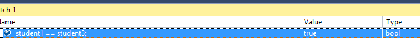

# Operadores en ``C#``

[![Github][github-shield]][github-url]
[![Kofi][kofi-shield]][kofi-url]
[![LinkedIn][linkedin-shield]][linkedin-url]
[![Khanakat][khanakat-shield]][khanakat-url]

## Tipo de operadores en ``C#``

Los operadores más utilizados en C# son:


## Operadores aritméticos en ``C#``

Los operadores aritméticos se definen para todos los tipos de datos numéricos. Los operadores +, -, *, / representan las operaciones aritméticas binarias básicas (suma, resta, multiplicación y división). El porcentaje de operador es el resto después de la división.

Lo importante a tener en cuenta es que el operador + se comporta de manera diferente con los tipos de números y cadenas. Con los números, el resultado de la expresión 5 + 5 es 10. Pero con las cadenas, el resultado de la expresión "5" + "5" es "55". Entonces, con el tipo de número, es un operador de suma, pero con el tipo de cadena, es un operador de concatenación.

## Operadores relacionales en ``C#``

Todos los operadores relacionales devuelven un resultado verdadero o falso. Se utilizan para comparar expresiones o variables de ambos lados del operador relacional. Estos operadores tienen una prioridad menor que los aritméticos. Entonces, en el siguiente ejemplo: x*a-8*b>y+5*z;el lado izquierdo del operador mayor que se ha calculado primero, luego el lado derecho y luego se comparan.

Para las variables de tipo valor y las cadenas, el ==operador (igualdad) devolverá verdadero solo si son iguales; de lo contrario, devolverá falso. Pero si las variables son tipos de referencia, el ==operador devolverá verdadero solo si esas dos variables apuntan a la misma ubicación de memoria; de lo contrario, devolverá falso.

Veamos esto a través de un ejemplo:

```csharp
class Program
{
    static void Main(string[] args)
    {
        int a = 15;
        int b = 15;

        string s1 = "This is a string";
        string s2 = "This is a string";

        Student student1 = new Student("John", 25);
        Student student2 = new Student("John", 25);
    }
}
```

Si colocamos un punto de interrupción en nuestro código e inspeccionamos el resultado usando la ventana Ver:


Vemos eso `a` y `b` son iguales al igual que los `s1` y `s2`. Pero los `student1` y `student2` no son iguales porque apuntan a diferentes ubicaciones de memoria. Pero si creamos otra variable de tipo `Student` y le asignamos el valor de student1 variable, el `==` operador devolverá verdadero:

```csharp
Student student1 = new Student("John", 25);
Student student2 = new Student("John", 25);

Student student3 = student1;
```



## Operadores logicos

Los operadores lógicos `&&` (y) y `||` (o) sirven para conectar valores lógicos. La expresión `<expression1>&&<expression2>` es verdadera solo si ambas expresiones son verdaderas. La expresión `<expression1>||<expression2>` es falsa solo si ambas expresiones son falsas; de lo contrario, es verdadera.

El `!` operador (negación) niega el valor lógico al que se aplica. Tiene la máxima prioridad de todos los operadores mencionados. Por lo tanto, la expresión `!logicalValue` será falsa solo si logicValue es verdadero y viceversa.

Veamos esto con un ejemplo:

```csharp
class Program
{
    static void Main(string[] args)
    {
        int a = 14;
        int b = 30;
        int c = 20;

        if(a < b && a < c)
        {
            Console.WriteLine($"min number is {a}");
        }

        if(a < b || a < c)
        {
            Console.WriteLine("The a variable is smaller then b or c");
        }

        if(!(a > b))
        {
            Console.WriteLine("a is less than b");
        }
    }
}
```

## Operadores de incremento y decremento

En el lenguaje C #, podemos usar operadores que aumentan y disminuyen el valor de la variable en 1. Esos operadores son `++` y `--`, y son muy útiles en muchos casos. Entonces, la mejor forma de escribir este código:

```csharp
static void Main(string[] args)
{
     int a = 15;
     a = a + 1; //now it is 16
}
```

Sería:

```csharp
static void Main(string[] args)
{
    int a = 15;
    a++; //now it is 16
}
```

Lo mismo se aplica al `--` operador.

Estos dos operadores tienen la notación de prefijo: `--variable`, `++variable` y las notaciones de sufijo: `variable--`, `variable++`. Aunque ambas notaciones cambiarán el valor en 1, el resultado será diferente. Esto es más fácil de explicar con un ejemplo:

```csharp
class Program
{
    static void Main(string[] args)
    {
        int a = 15;
        int b = --a;

        int c = 20;
        int d = c--;
    }
}
```


Lo que podemos notar es que la notación de prefijo disminuye el valor de la `a` variable primero y luego asigna ese valor a la `b` variable. Pero la expresión con notación de sufijo es diferente. El valor de la `c` variable se asigna `d` primero a la variable y luego se reduce en 1.

Lo mismo se aplica al operador de incremento:

```csharp
class Program
{
    static void Main(string[] args)
    {
        int a = 15;
        int b = ++a;

        int c = 20;
        int d = c++;
    }
}
```


## Conclusión

Excelente. Ahora tenemos más conocimiento sobre los operadores en C#.

<!--- reference style links --->
[github-shield]: https://img.shields.io/badge/-@fernandocalmet-%23181717?style=flat-square&logo=github
[github-url]: https://github.com/fernandocalmet
[kofi-shield]: https://img.shields.io/badge/-@fernandocalmet-%231DA1F2?style=flat-square&logo=kofi&logoColor=ff5f5f
[kofi-url]: https://ko-fi.com/fernandocalmet
[linkedin-shield]: https://img.shields.io/badge/-fernandocalmet-blue?style=flat-square&logo=Linkedin&logoColor=white&link=https://www.linkedin.com/in/fernandocalmet
[linkedin-url]: https://www.linkedin.com/in/fernandocalmet
[khanakat-shield]: https://img.shields.io/badge/khanakat.com-brightgreen?style=flat-square
[khanakat-url]: https://khanakat.com