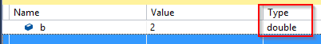
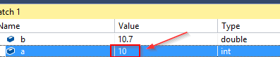

# Conversión de tipos en ``C#``

[![Github][github-shield]][github-url]
[![Kofi][kofi-shield]][kofi-url]
[![LinkedIn][linkedin-shield]][linkedin-url]
[![Khanakat][khanakat-shield]][khanakat-url]

## Conversión implícita en ``C#``

Se podrían interpretar muchos datos diferentes utilizando diferentes tipos. Por ejemplo, el número 74 se puede interpretar como un número entero pero también como doble (74.0). Hay dos situaciones en las que se aplica la conversión implícita.

El primero es cuando calculamos una expresión. El compilador adapta automáticamente los tipos de datos que usamos en esa expresión:

```csharp
class Program
{
    static void Main(string[] args)
    {
        double b = 12.45;
        int x = 10;
        b = b + x;
    }
}
```

Aquí la `b` variable es de tipo double y `x` es de tipo int. En la expresión `b + x`, el compilador convierte implícitamente `x` de int a double y luego asigna un resultado al `b`.

La segunda situación para la conversión es cuando el compilador almacena el resultado en una variable:

```csharp
class Program
{
    static void Main(string[] args)
    {
        int y = 20;
        int x = 10;
        double b;
        b = y / x;
    }
}
```



En este ejemplo, vemos que ambos `x` y  `y` son del tipo int, pero el resultado es del tipo double.

Ahora, prestemos atención a este ejemplo:

```csharp
int x = 21;
int y = 5

double b = x/y;
```

¿Qué piensas, qué valor se almacena en la variable `b`?

La respuesta: "El resultado es 4,2" no es correcta. Por supuesto, ahora va la pregunta: "¿Pero por qué"?

El compilador calcula primero la expresión del lado derecho y solo luego convierte ese resultado en doble. Entonces, la expresión del lado derecho `x/y` consta de números enteros, por lo que el resultado también es un número entero, en este ejemplo, es 4 (el valor está truncado). Después de ese cálculo, el compilador convierte el resultado en un doble y asigna el valor a la variable b:

```csharp
class Program
{
    static void Main(string[] args)
    {
        int y = 5;
        int x = 21;
        double b = x / y;
    }
}
```


Podemos arreglar esto si queremos, usando la conversión explícita en cualquiera de las variables `x` o `y` en la expresión.

## Conversión explícita en ``C#``

Para la conversión explícita, necesitamos escribir código adicional para convertir un tipo en otro. Tenemos dos formas diferentes, usando un operador de conversión o usando la Convertclase.

Veamos el siguiente ejemplo:


El compilador se queja de una conversión no válida. Lo que nos falta aquí es el operador de conversión, así que usémoslo:

```csharp
class Program
{
    static void Main(string[] args)
    {
        int a;
        double b = 10.7;

        a = (int)b;
    }
}
```



Al usar la `(int)` conversión de conversión, podemos transmitir de manera segura nuestros tipos de datos y el compilador lo aprueba. Pero lo que podemos ver es que nuestro resultado no es el que esperaríamos. Pero este es el resultado correcto. Es muy importante comprender que el operador de conversión puede reducir los datos cuando convertimos el tipo con el alcance de valor más grande a un tipo con el alcance de valor más pequeño. Como hicimos con la conversión de doble a int, por ejemplo.

Ahora podemos aplicar el operador de conversión en nuestro ejemplo de la parte Conversión implícita, para obtener el resultado correcto:

```csharp
class Program
{
    static void Main(string[] args)
    {
        int x = 21;
        int y = 5;

        double b = (double)x / y;
    }
}
```

El resultado será 4.2.

## Usando la clase Convert en ``C#``

Como dijimos, podemos usar la clase Convert con sus métodos estáticos, para convertir explícitamente un tipo base a otro tipo base:

```csharp
class Program
{
    static void Main(string[] args)
    {
        int a = 15;
        string s = a; // this is not allowed

        int c = 15;
        string s1 = Convert.ToString(c); 
        //or
        string s2 = c.ToString();

    }
}
```

## Conclusión

Hemos aprendido sobre la conversión de tipos y cómo se comporta la conversión implícita y explícita en C #.

<!--- reference style links --->
[github-shield]: https://img.shields.io/badge/-@fernandocalmet-%23181717?style=flat-square&logo=github
[github-url]: https://github.com/fernandocalmet
[kofi-shield]: https://img.shields.io/badge/-@fernandocalmet-%231DA1F2?style=flat-square&logo=kofi&logoColor=ff5f5f
[kofi-url]: https://ko-fi.com/fernandocalmet
[linkedin-shield]: https://img.shields.io/badge/-fernandocalmet-blue?style=flat-square&logo=Linkedin&logoColor=white&link=https://www.linkedin.com/in/fernandocalmet
[linkedin-url]: https://www.linkedin.com/in/fernandocalmet
[khanakat-shield]: https://img.shields.io/badge/khanakat.com-brightgreen?style=flat-square
[khanakat-url]: https://khanakat.com